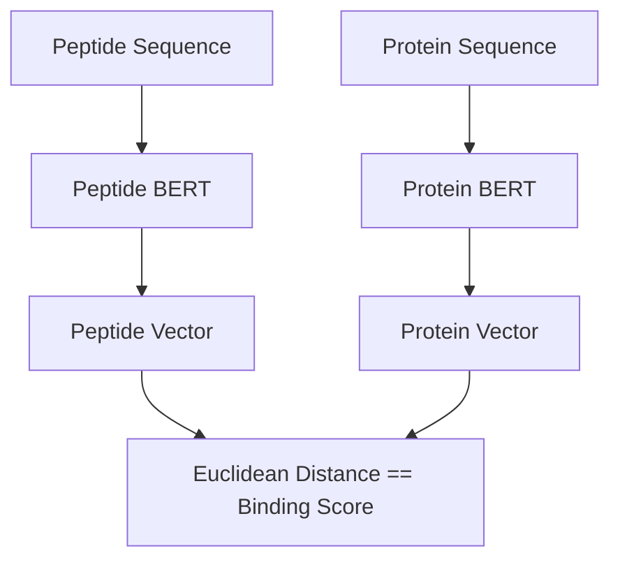
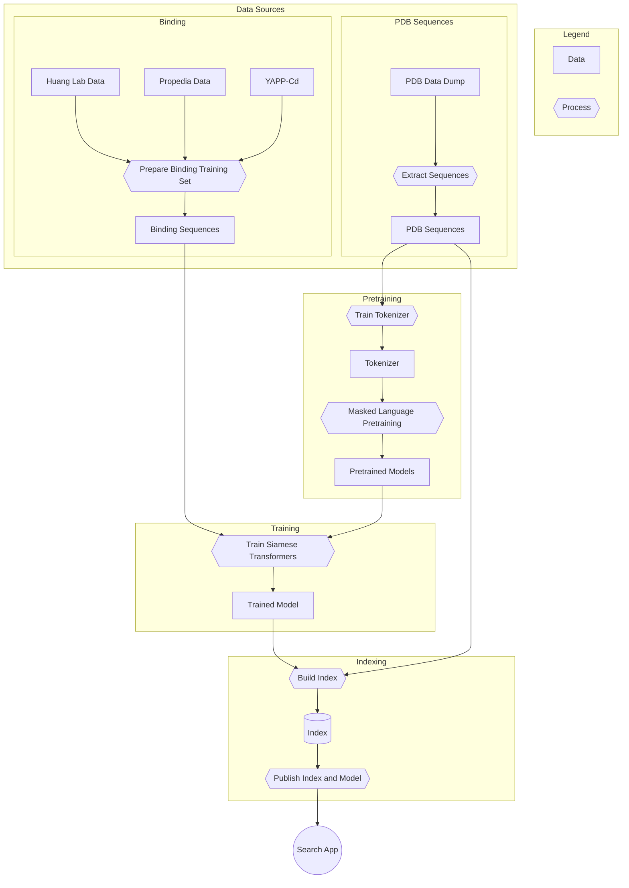

# Peptriever - Official Implementation

## Model Architecture

```mermaid
flowchart TD
    protein_sequence[Protein Sequence] --> protein_encoder[Protein BERT] --> protein_vector[Protein Vector]
    peptide_sequence[Peptide Sequence] --> peptide_encoder[Peptide BERT] --> peptide_vector[Peptide Vector]
    peptide_vector --> euclidean[Euclidean Distance == Binding Score] 
    protein_vector --> euclidean
```

## System Architecture Diagram

```mermaid
flowchart TD
    subgraph legend[Legend]
        data[Data]
        process{{Process}}
    end

    subgraph data_sources[Data Sources]

        subgraph pdb_seq[PDB Sequences]
            pdb_dump[PDB Data Dump] --> extract_sequences{{Extract Sequences}} --> pdb_sequences[PDB Sequences]
            click pdb_sequences "https://huggingface.co/datasets/ronig/pdb_sequences" "huggingface dataset"
        end
        
        subgraph binding[Binding]
            huang_data[Huang Lab Data]
            propedia_data[Propedia Data]
            yapp_data[YAPP-Cd]
            huang_data --> preprocess_train_data{{Prepare Binding Training Set}}
            propedia_data --> preprocess_train_data
            yapp_data --> preprocess_train_data
            preprocess_train_data --> binding_sequences[Binding Sequences]
            click binding_sequences "https://huggingface.co/datasets/ronig/protein_binding_sequences" "huggingface dataset"
        end
        
    end

    subgraph pretraining[Pretraining]
        pdb_sequences --> train_tokenizer{{Train Tokenizer}} --> tokenizer[Tokenizer]
        tokenizer --> mlm_pretraining{{Masked Language Pretraining}}
        mlm_pretraining --> pretrained_mlm[Pretrained Models]
        click tokenizer "https://huggingface.co/ronig/pdb_bpe_tokenizer_1024_mlm" "huggingface model"
    end
    
    subgraph training[Training]
        pretrained_mlm --> train_siamese{{Train Siamese Transformers}}
        binding_sequences --> train_siamese
        train_siamese --> trained_model[Trained Model]
        click trained_model "https://huggingface.co/ronig/siamese_protein_bert" "huggingface model"
    end
    
    subgraph indexing[Indexing]
        trained_model --> build_index{{Build Index}}
        pdb_sequences --> build_index
        build_index --> knn_index[(Index)]
        knn_index --> publish_index_model{{Publish Index and Model}}
        click knn_index "https://huggingface.co/datasets/ronig/siamese_protein_index" "huggingface dataset"
    end

    publish_index_model --> search_app((Search App))
    click search_app "https://huggingface.co/spaces/ronig/protein_binding_search" "huggingface space"

```