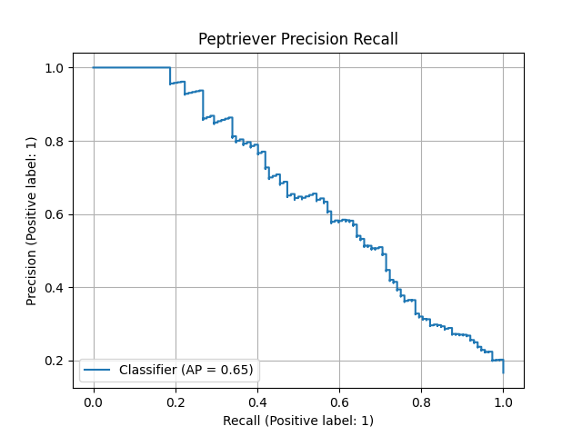
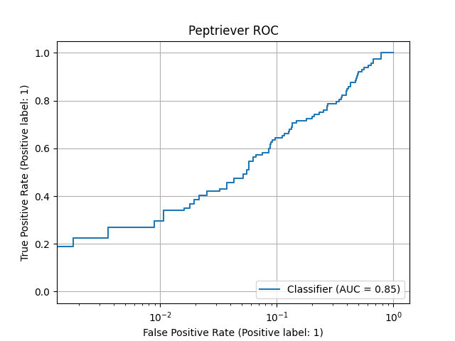

# Peptriever

[](https://peptriever.app)
[](https://github.com/RoniGurvich/Peptriever/actions/workflows/ci.yml)
[](https://github.com/psf/black)
[](https://app.codacy.com/gh/RoniGurvich/Peptriever/dashboard)
[](https://www.biorxiv.org/content/10.1101/2023.07.13.548811v1)

## About

This repo contains all the code needed in order to train Peptriever end to end.

## Local Setup

The dependencies are managed using [Poetry](https://python-poetry.org/).

You can set up your local virtual environment with all the dependencies by running:

```bash
make setup
```

## System Architecture Diagram


## Model Details

### Model Architecture

Peptriever is a Bi Encoder Bert model, combined with a Byte-Pair Encoding tokenizer.


### Evaluation Results

The model was evaluated on the test set
from [Johansson-Akhe et al.](https://www.frontiersin.org/articles/10.3389/fbinf.2022.959160/full)



